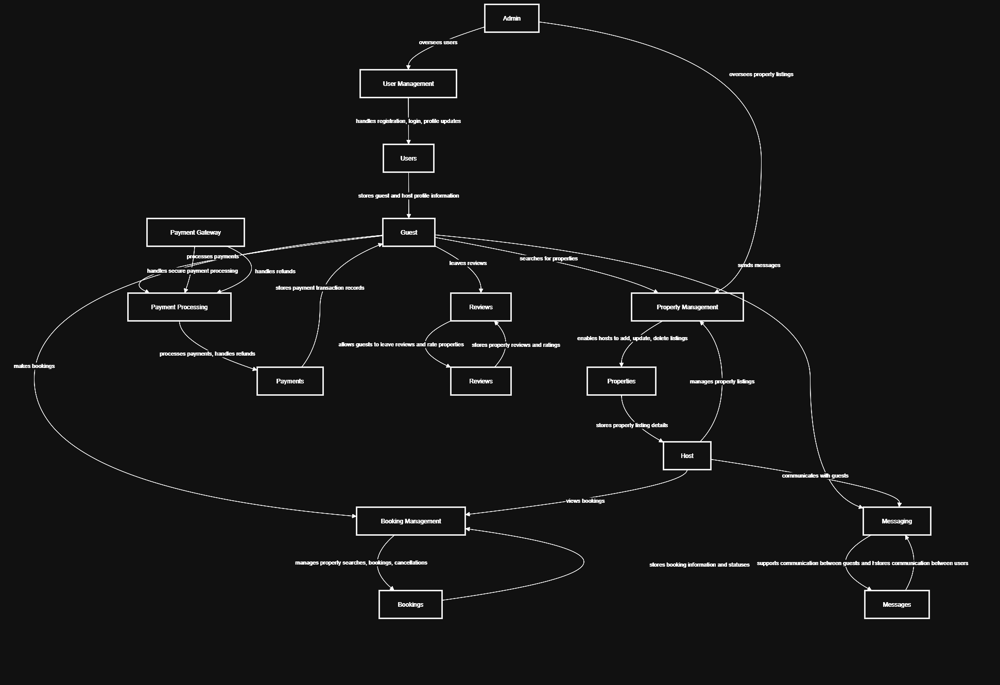

# Airbnb Clone – Data Flow Diagram

This directory contains the **Data Flow Diagram (DFD)** for the Airbnb Clone backend system.  
The diagram illustrates how data flows between users, processes, and data stores within the system.

## Description

The **Data Flow Diagram (DFD)** for the Airbnb Clone backend illustrates how data moves between users, processes, and data stores within the system. It captures the core backend operations, including user management, property listings, bookings, payments, messaging, and reviews.

### Key Elements:
- **External Entities:** Guest, Host, Admin, Payment Gateway  
- **Processes:** User Management, Property Management, Booking Management, Payment Processing, Messaging, Reviews  
- **Data Stores:** Users, Properties, Bookings, Payments, Messages, Reviews  
- **Data Flows:** Arrows indicate the direction of information between entities, processes, and data stores.

This DFD provides a high-level overview of the backend system’s operations, helping developers and stakeholders understand how data is processed and stored.

## Diagram

