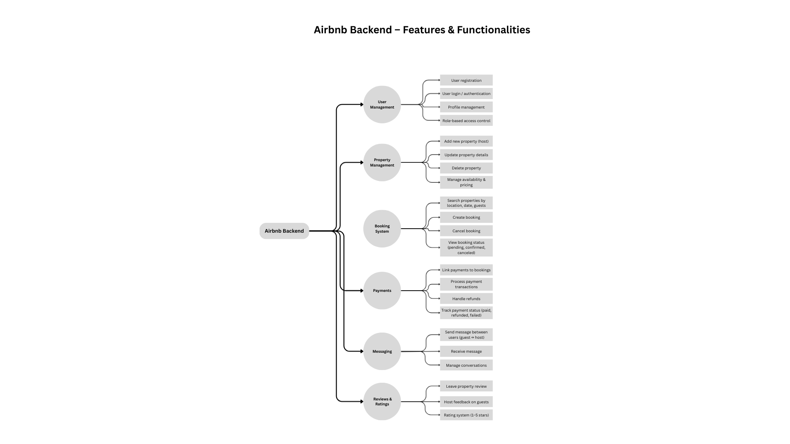

# alx-airbnb-project-documentation

# ✨ Airbnb Clone – Backend Features & Functionalities

This document provides an overview of the **core backend features** required for the Airbnb Clone project.  
The diagram below visually represents the main modules and their functionalities.

---

## 📌 Features Overview

- **User Management**
  - User registration & authentication
  - Profile updates
  - Password reset
  - Role-based access control

- **Property Management**
  - Add property
  - Update property
  - Delete property
  - Manage availability & pricing

- **Booking System**
  - Search properties
  - Create booking
  - Cancel booking
  - View booking status

- **Payments**
  - Link payments to bookings
  - Process payments
  - Handle refunds
  - Track payment status

- **Messaging**
  - Send messages
  - Receive messages
  - Manage conversations

- **Reviews & Ratings**
  - Leave property reviews
  - Host feedback on guests
  - Star rating system (1–5)

---

## 🖼️ System Diagram

The diagram below illustrates the **backend features and functionalities**:

---

## 📂 Repository Structure

