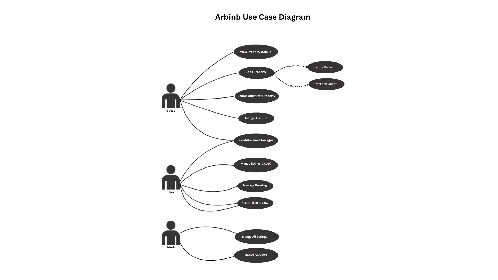

# Airbnb Clone – Use Case Diagram

This diagram shows how different users interact with the Airbnb Clone backend.

## Actors
- **Guest** – searches properties, books, messages, and leaves reviews.  
- **Host** – manages property listings and communicates with guests.  
- **Admin** – manages users and listings.  

## Use Case Diagram

